<a href="https://github.com/999david7/Cortex">Cortex</a> &nbsp;·&nbsp;
<a href="https://github.com/999david7/bean4U">bean4U</a> &nbsp;·&nbsp;
<a href="https://github.com/999david7/Formula-Arch">Formula Arch</a> &nbsp;·&nbsp;
<a href="https://github.com/999david7/David-Winkler">Portfolio</a>

  

<a href="mailto:999david01@gmx.at">Email</a> &nbsp;·&nbsp;
<a href="https://github.com/999david7">GitHub</a> &nbsp;·&nbsp;
<a href="https://www.instagram.com/999david01">Instagram</a> &nbsp;·&nbsp;
<a href="https://github.com/999david7/David-Winkler/blob/main/files/resume.pdf">CV</a>

