<!-- ░░░ HEADER ░░░ -->
<div align="center">




<a href="https://github.com/999david7">
  
</a>

<br/>


</div>

<br/>

## `$ whoami`

```yaml
name:      David Winkler
handle:    999david7
location:  Austria 🇦🇹
school:    HTL
focus:     [software, AI, automation, whatever comes next]
motto:     "keep building."
```

## `$ ls ~/projects`

<table>
<tr>
<td width="33%" valign="top">

### 🤖 AI & Automation
AI-powered tools, agents and automation experiments.

<sub>`Python` `FastAPI` `LLMs` `RAG`</sub>

</td>
<td width="33%" valign="top">

### 🌐 Web Projects
Building applications and experimenting with new ideas.

<sub>`TypeScript` `React` `Next.js`</sub>

</td>
<td width="33%" valign="top">

### 🧪 Random Stuff
Side projects and things I build because I can.

<sub>`Python` `Docker` `Git`</sub>

</td>
</tr>
</table>

## `$ cat ~/stack`

<div align="center">


<br/><br/>


</div>

```text
ai/llm   →  OpenAI · Claude · Gemini · RAG
```

## `$ ./currently.sh`

```diff
+ building
+ learning
+ experimenting
! making questionable engineering decisions
```

## `$ git log --stats`

<div align="center">


</div>

## `$ snake --eat contributions`

<div align="center">

<picture>
  <source media="(prefers-color-scheme: dark)" srcset="https://raw.githubusercontent.com/999david7/999david7/output/github-snake-dark.svg" />
  <source media="(prefers-color-scheme: light)" srcset="https://raw.githubusercontent.com/999david7/999david7/output/github-snake.svg" />
  
</picture>

</div>

<br/>

<div align="center">

```text
$ cat ~/banner.txt

██████╗  █████╗ ██╗   ██╗██╗██████╗     ██╗    ██╗
██╔══██╗██╔══██╗██║   ██║██║██╔══██╗    ██║    ██║
██║  ██║███████║██║   ██║██║██║  ██║    ██║ █╗ ██║
██║  ██║██╔══██║╚██╗ ██╔╝██║██║  ██║    ██║███╗██║
██████╔╝██║  ██║ ╚████╔╝ ██║██████╔╝    ╚███╔███╔╝██╗
╚═════╝ ╚═╝  ╚═╝  ╚═══╝  ╚═╝╚═════╝      ╚══╝╚══╝ ╚═╝

$ echo "keep building"
keep building.
```

<sub>✦ made with curiosity ✦</sub>


</div>
