<a href="https://github.com/999david7/David-Winkler">Portfolio</a> &nbsp;·&nbsp;
<a href="mailto:999david01@gmx.at">Email</a> &nbsp;·&nbsp;
<a href="https://www.instagram.com/999david01">Instagram</a>

